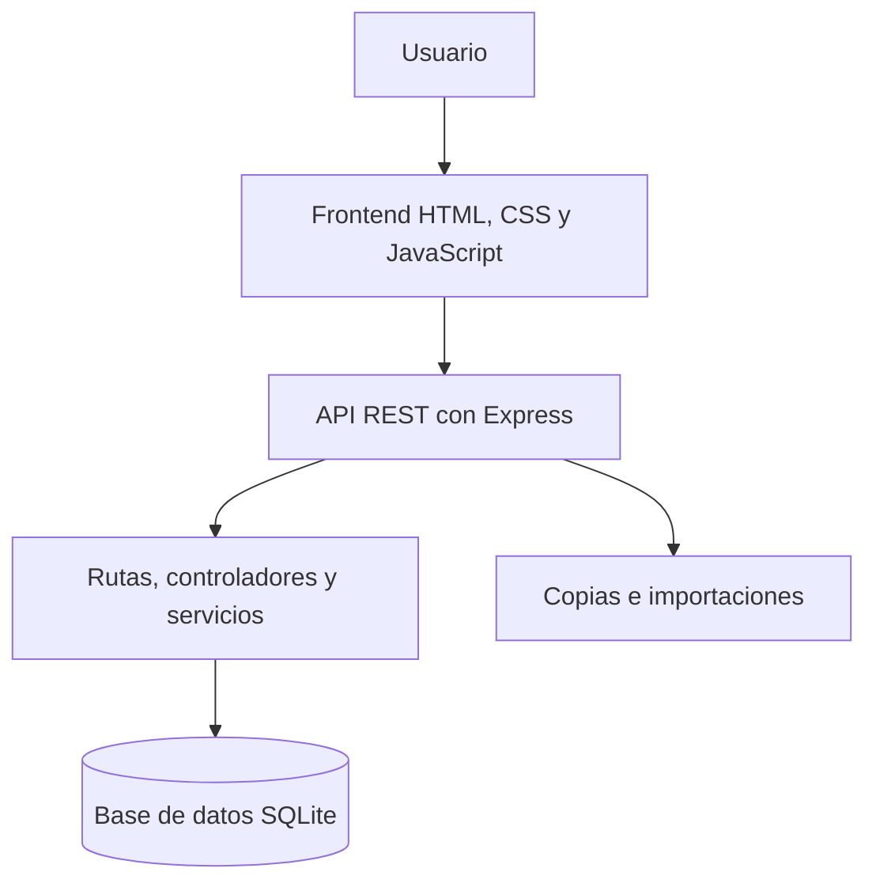
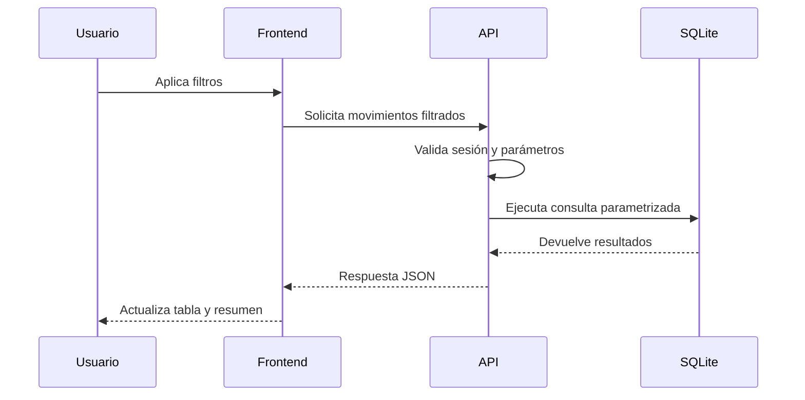

# CashFlow Control — Caso de estudio

Aplicación fullstack para registrar, clasificar y analizar los movimientos de tesorería de una empresa.

> **Nota:** el código fuente se mantiene en un repositorio privado porque CashFlow Control es una herramienta interna. Este repositorio documenta el problema, la arquitectura, las decisiones técnicas y el trabajo realizado. Todas las imágenes y datos mostrados son ficticios.

---

## Problema que resuelve

La gestión de ingresos y gastos mediante hojas de cálculo dispersas dificulta conocer el estado real de la tesorería, aplicar criterios homogéneos de clasificación y consultar rápidamente la evolución económica.

CashFlow Control centraliza esta información y permite:

* Registrar ingresos y gastos.
* Consultar el saldo y la evolución de la tesorería.
* Clasificar movimientos mediante categorías y subcategorías.
* Buscar y filtrar movimientos.
* Importar y exportar información.
* Visualizar indicadores y tendencias.
* Administrar usuarios y permisos.
* Realizar copias de seguridad y restauraciones.

La aplicación está diseñada para ejecutarse dentro de una red local y mantener los datos en infraestructura controlada por la organización.

---

## Mi participación

He diseñado y desarrollado el proyecto completo, tanto el frontend como el backend.

Mi trabajo ha incluido:

* Análisis del problema y definición de requisitos.
* Diseño de la arquitectura cliente-servidor.
* Desarrollo de una API REST con Node.js y Express.
* Diseño y gestión de la base de datos SQLite.
* Desarrollo de la interfaz con HTML, CSS y JavaScript.
* Implementación del CRUD de movimientos.
* Creación de filtros, ordenación y paginación.
* Desarrollo de dashboards y gráficos.
* Implementación de autenticación y control de acceso por roles.
* Importación y exportación de movimientos.
* Sistema de copias de seguridad y restauración.
* Preparación del despliegue en red local.
* Organización del trabajo con Git, ramas y versiones.
* Pruebas funcionales y de regresión antes de integrar cambios.
* Documentación técnica y planificación del roadmap.

---

## Stack tecnológico

### Backend

* Node.js
* Express
* SQLite
* API REST
* dotenv
* Multer
* XLSX

### Frontend

* HTML5
* CSS3
* JavaScript
* Fetch API
* Chart.js

### Infraestructura y herramientas

* Git y GitHub
* Windows 11
* PowerShell
* NSSM para ejecutar Node.js como servicio
* Despliegue en red local
* Cursor y ChatGPT como herramientas de apoyo al desarrollo

---

## Funcionalidades principales

### Gestión de movimientos

* Creación de ingresos y gastos.
* Edición y eliminación de movimientos.
* Categorías y subcategorías.
* Validación de datos.
* Consulta paginada.
* Ordenación por diferentes columnas.

### Búsqueda y filtros

* Filtrado por fechas.
* Filtrado por categorías.
* Combinación de varios criterios.
* Conservación de los filtros durante la navegación.
* Exportación respetando los filtros y la ordenación seleccionados.

### Dashboard

* Resumen de ingresos.
* Resumen de gastos.
* Saldo acumulado.
* Distribución por categorías y subcategorías.
* Gráficos de evolución y tendencias.
* Comparación visual de periodos.

### Importación y exportación

* Importación de movimientos bancarios y de tarjeta desde formatos compatibles.
* Validación previa de los datos importados.
* Exportación CSV.
* Exportación completa cuando no existen filtros.
* Exportación de todos los resultados coincidentes sin limitarse a la página visible.

### Usuarios y administración

* Inicio de sesión.
* Control de acceso por roles.
* Restricción de funcionalidades administrativas.
* Gestión de usuarios.
* Operaciones protegidas desde el backend.

### Copias de seguridad

* Creación controlada de copias de seguridad.
* Restauración de datos.
* Confirmación previa para operaciones sensibles.
* Información del progreso durante operaciones administrativas.

---

## Capturas de demostración

Todas las siguientes imágenes utilizan información ficticia.

### Acceso a la aplicación

### Dashboard

### Gestión de movimientos

### Administración de usuarios

---

## Arquitectura

La aplicación utiliza una arquitectura cliente-servidor. Express sirve tanto la API como los archivos del frontend, lo que permite desplegar toda la solución mediante un único servicio de Node.js.

### Backend

El backend se encarga de:

* Arrancar y configurar la aplicación.
* Cargar las variables de entorno.
* Inicializar la base de datos.
* Exponer los endpoints de la API.
* Validar las solicitudes.
* Aplicar las reglas de negocio.
* Comprobar autenticación y permisos.
* Ejecutar consultas SQL.
* Gestionar importaciones y copias de seguridad.

La lógica se distribuye progresivamente entre rutas, controladores y servicios para evitar concentrar todas las responsabilidades en un único archivo.

### Frontend

El frontend incluye:

* Interfaz principal y navegación.
* Gestión de sesión.
* Peticiones autenticadas a la API.
* Formularios de movimientos.
* Filtros, ordenación y paginación.
* Gestión administrativa.
* Tablas del dashboard.
* Gráficos con Chart.js.
* Mensajes de estado y gestión de errores.

Chart.js se mantiene dentro del propio proyecto para evitar depender de un CDN en el entorno de producción.

### Base de datos

SQLite almacena los movimientos y la información necesaria para el funcionamiento de la aplicación.

Se eligió porque:

* La aplicación se utiliza dentro de una red local.
* El volumen de datos es controlado.
* No requiere mantener otro servicio de base de datos.
* Facilita las copias de seguridad.
* Simplifica el despliegue y la recuperación.

---

## Ejemplo del flujo de una operación

---

## Decisiones técnicas

### Backend y frontend en un mismo repositorio

El backend sirve la API y el frontend. Esto permite ejecutar la aplicación completa mediante un solo proceso de Node.js y simplifica su instalación en el servidor local.

### SQLite para un entorno controlado

El objetivo no era crear inicialmente una plataforma SaaS multiusuario, sino una herramienta interna fiable y sencilla de mantener. SQLite resultaba suficiente para el volumen y la concurrencia previstos.

### Exportación coherente con la interfaz

La exportación reutiliza los filtros y la ordenación seleccionados por el usuario, pero elimina los parámetros de paginación. De esta manera se exportan todos los movimientos coincidentes y no solamente los visibles en la página actual.

### Validación en el backend

Las restricciones de acceso no dependen únicamente de ocultar botones en la interfaz. El backend comprueba la sesión, los permisos y los parámetros antes de ejecutar operaciones protegidas.

### Dependencias frontend locales

Las librerías necesarias para producción se sirven desde la propia aplicación. Esto reduce dependencias externas y facilita el funcionamiento en una red con acceso limitado a Internet.

---

## Seguridad y privacidad

CashFlow Control trabaja con información financiera, por lo que se han aplicado las siguientes medidas:

* Ejecución dentro de una red local.
* Repositorio de código privado.
* Variables de entorno excluidas de Git.
* Base de datos excluida del repositorio.
* Autenticación de usuarios.
* Control de acceso por roles.
* Validación de operaciones desde el backend.
* Confirmación antes de acciones sensibles.
* Copias de seguridad fuera del repositorio.
* Ausencia de datos reales en este caso de estudio.

Este repositorio público no incluye:

* Código fuente de producción.
* Credenciales.
* Archivos `.env`.
* Bases de datos.
* Copias de seguridad.
* Direcciones IP internas.
* Información de empresas, usuarios o proveedores.
* Movimientos o importes financieros reales.

---

## Flujo de trabajo con Git

El desarrollo se organiza mediante las siguientes ramas:

* `main`: versiones estables destinadas a producción.
* `development`: integración y validación de cambios.
* `feature/*`: nuevas funcionalidades.
* `fix/*`: correcciones de errores.
* `docs/*`: cambios de documentación cuando son necesarios.

El flujo habitual es:

1. Crear una rama desde `development`.
2. Implementar una funcionalidad o corrección concreta.
3. Realizar pruebas funcionales.
4. Revisar los cambios.
5. Integrarlos en `development`.
6. Preparar una versión estable.
7. Integrar la versión validada en `main`.
8. Desplegarla de forma controlada.

---

## Despliegue

El proyecto ha evolucionado también en su infraestructura.

Una primera versión se desplegó en un servidor Ubuntu utilizando PM2. Posteriormente se adaptó para ejecutarse como servicio de Node.js en Windows 11 dentro de la red local.

El despliegue actual utiliza:

* Node.js en modo producción.
* Variables de entorno.
* NSSM para gestionar la aplicación como servicio.
* Scripts PowerShell para instalación y mantenimiento.
* Base de datos SQLite inicializada fuera del repositorio.
* Acceso restringido a la red local.
* Proceso controlado de actualización y verificación.

No existe una demo pública porque la aplicación está diseñada para un entorno interno y maneja información financiera.

---

## Calidad y pruebas

Antes de integrar una nueva versión se comprueban, entre otros, los siguientes flujos:

* Inicio y cierre de sesión.
* Restricciones por roles.
* Creación, edición y eliminación de movimientos.
* Filtros y combinaciones de criterios.
* Ordenación y paginación.
* Exportación con y sin filtros.
* Cálculos del dashboard.
* Categorías y subcategorías.
* Importación de archivos.
* Creación y restauración de copias.
* Comportamiento ante datos incorrectos.
* Arranque del servicio en el entorno de producción.

Las incidencias detectadas se corrigen en ramas `fix/*` separadas antes de crear una nueva versión estable.

---

## Principales dificultades

### Sincronización de consultas y componentes

Uno de los retos principales fue mantener sincronizados los filtros, la ordenación, la paginación, las exportaciones y los dashboards.

Un cambio aparentemente pequeño en un filtro podía afectar a:

* La consulta SQL.
* La tabla de movimientos.
* El total de resultados.
* La paginación.
* La exportación.
* Los cálculos y gráficos.

### Evolución de una aplicación en uso

El proyecto comenzó con una estructura sencilla y fue incorporando nuevas responsabilidades. Ha sido necesario mantener la compatibilidad con los datos existentes mientras se añadían usuarios, permisos, subcategorías, gráficos, importaciones y copias de seguridad.

### Complejidad creciente del frontend

El núcleo inicial del frontend creció considerablemente a medida que se añadieron funcionalidades. Esto permitió avanzar rápidamente, pero también mostró la necesidad de dividirlo progresivamente en módulos más pequeños y fáciles de probar.

### Operaciones sensibles

La restauración de copias, la gestión de usuarios y la modificación de datos financieros requieren validaciones adicionales, confirmaciones y un tratamiento comprensible de los errores.

---

## Uso de herramientas de IA

Durante el desarrollo he utilizado Cursor y ChatGPT como herramientas de apoyo para:

* Analizar requisitos.
* Preparar planes de implementación.
* Revisar alternativas.
* Generar propuestas de refactorización.
* Crear casos de prueba.
* Revisar documentación.
* Detectar posibles errores.

Las decisiones de arquitectura, la integración, las pruebas y la validación final las realizo personalmente. La IA se utiliza como acelerador del trabajo, no como sustituto de la comprensión del código.

---

## Limitaciones actuales

* Está diseñada principalmente para una red local.
* Utiliza SQLite y no está planteada todavía como plataforma multiempresa.
* Parte del frontend necesita una mayor modularización.
* No dispone de una demo pública.
* La integración bancaria mediante Norma 43 continúa dentro del roadmap.
* La migración completa a TypeScript todavía no se ha realizado.

---

## Roadmap

Entre las siguientes mejoras previstas se encuentran:

* Importación bancaria mediante Norma 43.
* Refactorización progresiva del frontend.
* División del núcleo JavaScript en módulos especializados.
* Ampliación de pruebas automatizadas.
* Mejora de la trazabilidad de las operaciones administrativas.
* Migración progresiva a TypeScript.
* Evaluación de Astro para la evolución del frontend.
* Mejora del proceso de despliegue y actualización.

Las funcionalidades del roadmap se presentan como trabajo planificado y no como características ya disponibles.

---

## Qué demuestra este proyecto

CashFlow Control refleja mi capacidad para:

* Convertir una necesidad empresarial en una aplicación funcional.
* Trabajar tanto en frontend como en backend.
* Diseñar y consultar una base de datos SQL.
* Crear y mantener una API.
* Implementar autenticación y autorización.
* Gestionar importaciones, exportaciones y copias de seguridad.
* Investigar errores y mantener una aplicación en uso.
* Trabajar con ramas, versiones y despliegues controlados.
* Utilizar herramientas de IA manteniendo el control técnico.

---

## Autor

**Antonio Zurano Blázquez**

Desarrollador Web Full Stack especializado en aplicaciones empresariales, backend, APIs e integraciones.

* [GitHub](https://github.com/AntonioZurano)
* [Portfolio](https://dev.antoniozurano.com)
* [LinkedIn](https://www.linkedin.com/in/antoniozurano)

---

## Código fuente

El código fuente se conserva en un repositorio privado.

Puede mostrarse durante un proceso de selección o revisión técnica, siempre que se preserve la confidencialidad de la información y del entorno donde se utiliza.

---

## Aviso

Las capturas, nombres, categorías, movimientos e importes empleados en este repositorio son completamente ficticios y se utilizan exclusivamente para documentar el funcionamiento del proyecto.

Copyright © 2026 Antonio Zurano Blázquez. Todos los derechos reservados.
