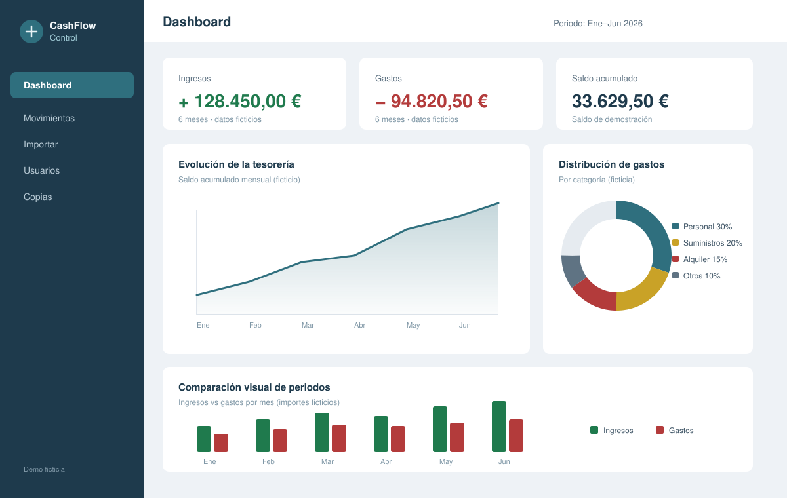
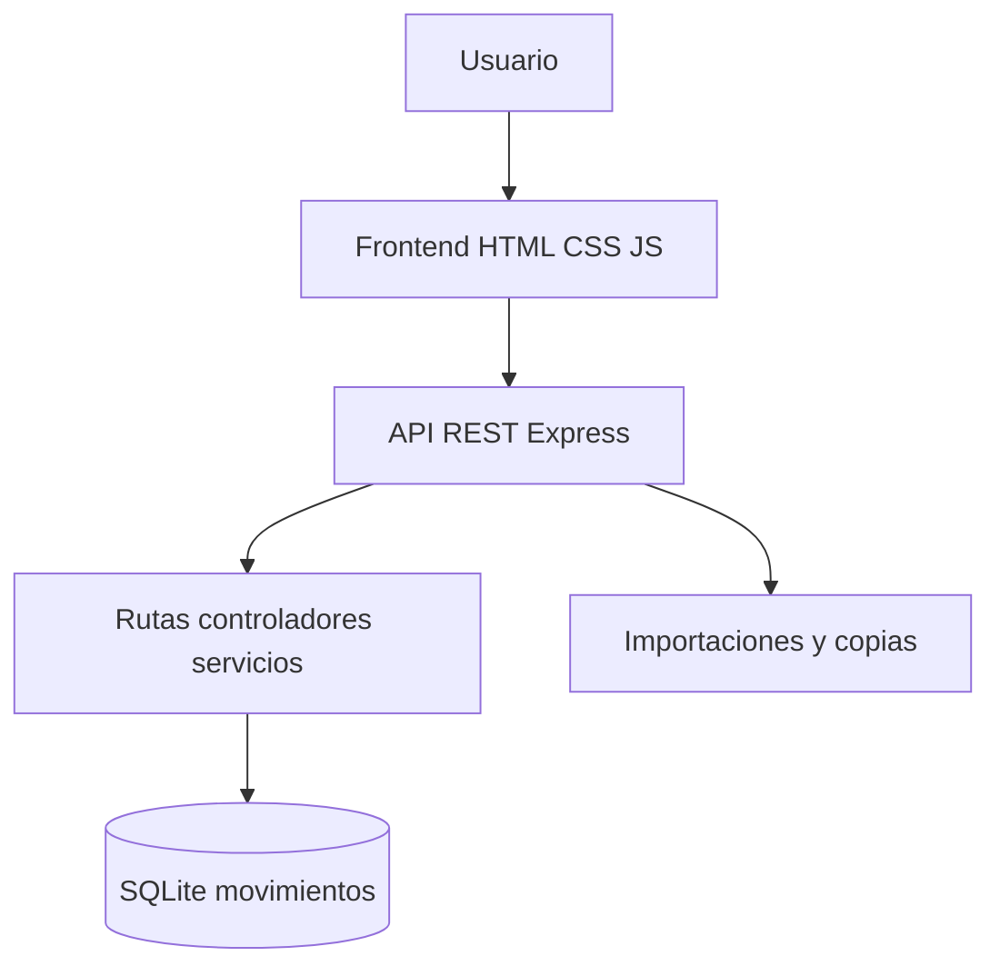
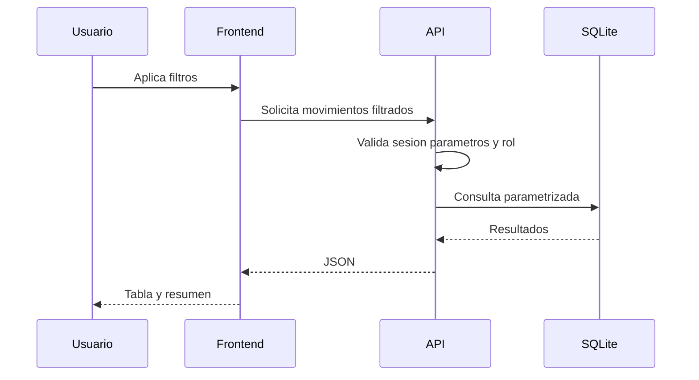
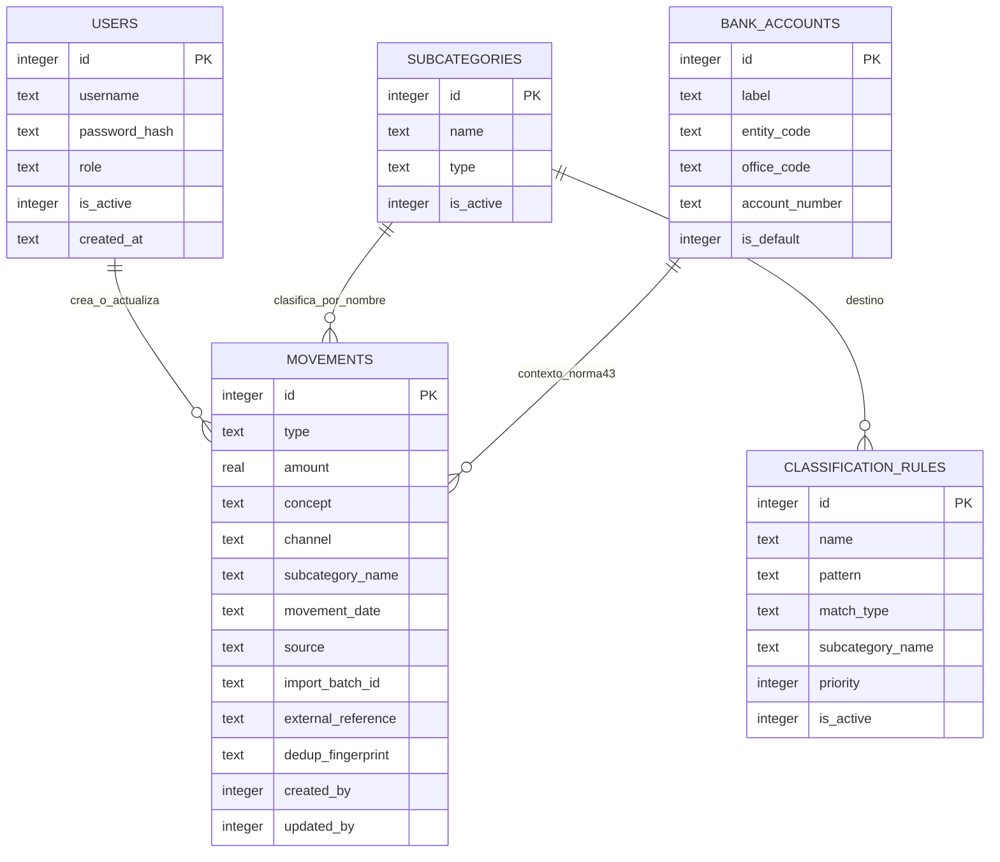
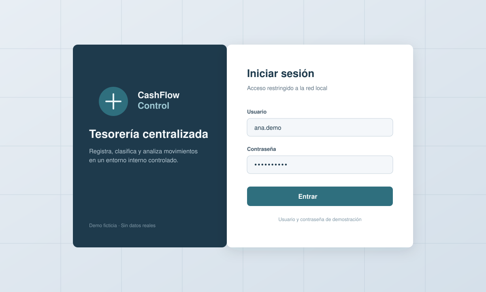
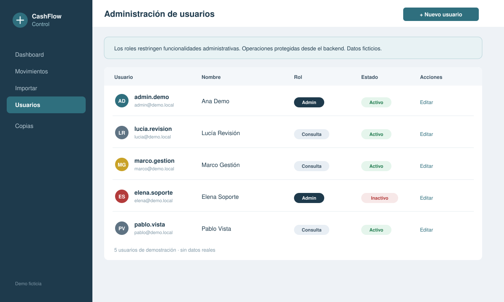
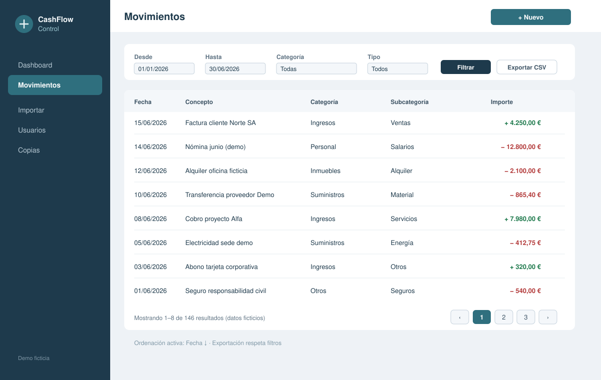

# CashFlow Control — Caso de estudio

Aplicación fullstack para registrar, clasificar, importar y analizar los movimientos de tesorería de una empresa en un entorno interno controlado.



> **Nota:** el código fuente se mantiene en un repositorio privado. Este repositorio documenta el problema, la arquitectura, el SQL y las decisiones técnicas con información, diagramas y datos completamente ficticios.

---

## Resumen ejecutivo

CashFlow Control centraliza ingresos y gastos que antes vivían en hojas de cálculo dispersas. Desarrollé el proyecto completo: interfaz en JavaScript, API REST con Node.js y Express, esquema SQLite, autenticación con sesiones, autorización por roles (`user` / `admin`), importaciones (CSV de tarjeta, XLS/XLSX bancario y Norma 43), exportadores, dashboards con agregaciones SQL, copias de seguridad y despliegue como servicio en red local.

La aplicación está en uso en un entorno real controlado. El código permanece privado porque contiene lógica e información empresarial. Este caso de estudio utiliza exclusivamente información ficticia o anonimizada.

### Evidencias técnicas rápidas

| Área | Evidencia |
| ---- | --------- |
| JavaScript | Interfaz, estado, filtros, formularios y consumo de API con Fetch |
| Node.js | API REST, servicios, importaciones, administración y backup |
| SQL | CRUD, joins lógicos, filtros dinámicos, agregaciones, paginación e índices de deduplicación |
| Seguridad | Sesión, RBAC en backend y validación de parámetros |
| Git | Ramas `feature` / `fix` / `docs`, integración en `development` y promoción a `main` |
| Producción | Servicio Node.js en red local (NSSM) y procedimiento de actualización |
| Diagnóstico | Reproducción con fixtures, causa raíz confirmada en importación CSV y regresión Vitest |
| IA | Apoyo para análisis y pruebas; revisión humana del diff y de las pruebas |

---

## Problema empresarial

La gestión de ingresos y gastos mediante hojas de cálculo dificulta conocer el saldo real, aplicar criterios homogéneos de clasificación y consultar la evolución económica con rapidez.

---

## Solución desarrollada

CashFlow Control permite:

* Registrar ingresos y gastos con validación.
* Consultar saldo, listados filtrados y evolución temporal.
* Clasificar por canal de origen y subcategoría.
* Importar extractos de tarjeta y banco (CSV, XLS/XLSX, Norma 43).
* Exportar CSV y Norma 43 respetando filtros (sin limitarse a la página visible).
* Visualizar dashboards y tendencias.
* Administrar usuarios, reglas de clasificación y cuentas bancarias.
* Crear y restaurar copias de seguridad de la base SQLite.

Diseñada para ejecutarse dentro de una red local, con los datos en infraestructura controlada por la organización.

---

## Mi responsabilidad en el proyecto

He diseñado y desarrollado el proyecto completo (frontend y backend):

* Análisis de requisitos y arquitectura cliente-servidor.
* API REST con Express y persistencia SQLite.
* CRUD, filtros, ordenación, paginación y exportación coherente.
* Dashboards y gráficos (Chart.js servido en local).
* Autenticación, RBAC y operaciones administrativas.
* Importaciones multi-formato, deduplicación bancaria y backup/restore.
* Despliegue en red local, flujo Git y pruebas (Vitest + checklist manual).

---

## Stack tecnológico

### Backend

* Node.js
* Express
* SQLite (`sqlite3`)
* API REST
* dotenv
* Multer
* XLSX
* Sesiones en SQLite (`connect-sqlite3`)
* bcrypt

### Frontend

* HTML5, CSS3, JavaScript
* Fetch API
* Chart.js (vendored en el proyecto, sin CDN)

### Infraestructura

* Git / GitHub
* Windows 11, PowerShell, NSSM
* Despliegue en red local
* Cursor y ChatGPT como apoyo (con control humano)

---

## Arquitectura

Express sirve la API y los estáticos del frontend en un único proceso Node.js.





---

## Modelo de datos anonimizado

El diagrama siguiente refleja la estructura **conceptual** verificada en el proyecto privado, con nombres genéricos. No es el DDL exacto de producción.



### Lectura del modelo

* **Claves primarias:** enteros autoincrementales en todas las tablas de aplicación.
* **Claves foráneas:** no hay `FOREIGN KEY` enforced en SQLite. La integridad es lógica: `created_by` / `updated_by` apuntan a `users.id`; la subcategoría se guarda como **nombre** en el movimiento y se alinea con `subcategories.name`.
* **Cardinalidades:** un usuario puede asociarse a muchos movimientos; una subcategoría clasifica muchos movimientos; las reglas apuntan a un nombre de subcategoría.
* **Tipo e importe:** `type` vale `income` o `expense`; `amount` se almacena siempre **positivo**. El signo contable no vive en el importe.
* **Canal:** `channel` discrimina el origen operativo (`cash`, `card`, `bank` en esta documentación anonimizada).
* **Lotes de importación:** no existe tabla `import_batches`; el lote es un UUID en `import_batch_id`.
* **Sesiones:** se almacenan en un fichero SQLite de sesión separado, no en el diagrama de negocio.
* **Simplificación pública:** se omiten columnas auxiliares sensibles (`raw_data`, saldos intermedios, etc.) y cualquier valor real de cuentas.

---

## SQL aplicado en el proyecto

Las consultas siguientes son **ejemplos representativos**, anonimizados y en ocasiones simplificados. Utilizan nombres genéricos, no contienen datos reales y reflejan problemas que la aplicación sí resuelve. Los valores procedentes del usuario se enlazan como parámetros (`?`) desde Node.js; no se concatenan en el SQL.

### Consulta 1 — Listado paginado con relación por nombre

**Problema:** mostrar una página de movimientos con la subcategoría resuelta, orden estable y paginación.

```sql
SELECT
    m.id,
    m.movement_date,
    m.concept,
    m.amount,
    m.type,
    m.channel,
    s.name AS subcategory_name,
    s.type AS subcategory_type
FROM movements AS m
LEFT JOIN subcategories AS s
    ON s.name = m.subcategory_name
WHERE m.movement_date BETWEEN ? AND ?
ORDER BY m.movement_date DESC, m.id DESC
LIMIT ? OFFSET ?;
```

**Explicación:** el `LEFT JOIN` por nombre conserva el movimiento aunque la subcategoría se haya desactivado o el texto no coincida con el catálogo. El segundo criterio `m.id` evita ordenaciones inestables cuando varias filas comparten fecha. `OFFSET` se calcula como `(page - 1) * pageSize` en el servicio.

**Riesgos:** un rename de subcategoría debe actualizar también los movimientos (la aplicación lo hace en cascada lógica). Sin parametrizar, un `LIKE` o una fecha concatenada abriría inyección SQL.

**Rendimiento:** el rango sobre `movement_date` beneficia de un índice por fecha (mejora futura; hoy el volumen local es controlado). El `LIMIT` acota el trabajo de serialización JSON.

### Consulta 2 — Filtros opcionales parametrizados

**Problema:** combinar criterios solo cuando el cliente los envía, sin montar SQL inseguro.

```javascript
const conditions = [];
const params = [];

if (dateFrom) {
  conditions.push("m.movement_date >= ?");
  params.push(dateFrom);
}

if (dateTo) {
  conditions.push("m.movement_date <= ?");
  params.push(dateTo);
}

if (channel) {
  conditions.push("m.channel = ?");
  params.push(channel);
}

if (subcategoryName) {
  conditions.push("m.subcategory_name = ?");
  params.push(subcategoryName);
}

if (search) {
  conditions.push("LOWER(m.concept) LIKE LOWER(?) ESCAPE '\\'");
  params.push(`%${search}%`);
}

const whereClause = conditions.length
  ? `WHERE ${conditions.join(" AND ")}`
  : "";
```

**Separación clave:**

* Fragmentos SQL (`m.channel = ?`) los controla la aplicación.
* Valores (`dateFrom`, `search`, …) van a la lista `params`.
* La columna de `ORDER BY` se elige desde una **lista blanca**, nunca desde texto libre del cliente.

### Consulta 3 — Recuento para paginación

**Problema:** calcular `total` y `totalPages` con los mismos filtros que el listado.

```sql
SELECT COUNT(*) AS total
FROM movements AS m
WHERE m.movement_date BETWEEN ? AND ?;
```

En producción, el `WHERE` se reutiliza desde el mismo constructor de condiciones que el `SELECT` de datos, **sin** `LIMIT` ni `OFFSET`.

Si listado y recuento divergieran, la UI mostraría páginas vacías, totales incorrectos o botones de paginación incoherentes.

### Consulta 4 — Resumen de ingresos, gastos y saldo

**Problema:** totales del periodo con una única regla contable (`amount` positivo + `type`).

```sql
SELECT
    COALESCE(
        SUM(CASE WHEN type = 'income' THEN amount ELSE 0 END),
        0
    ) AS total_income,
    COALESCE(
        SUM(CASE WHEN type = 'expense' THEN amount ELSE 0 END),
        0
    ) AS total_expenses,
    COALESCE(
        SUM(
            CASE
                WHEN type = 'income' THEN amount
                WHEN type = 'expense' THEN -amount
                ELSE 0
            END
        ),
        0
    ) AS balance
FROM movements
WHERE movement_date BETWEEN ? AND ?;
```

`CASE` discrimina el tipo; `SUM` agrega; `COALESCE` evita `NULL` cuando no hay filas. Mezclar signos en `amount` y además usar `type` rompería el dashboard: la regla interna debe ser única.

### Consulta 5 — Agregación por subcategoría

**Problema:** distribución para gráficos manteniendo subcategorías sin movimiento en el periodo (o excluyéndolas según la vista).

```sql
SELECT
    s.id,
    s.name,
    COUNT(m.id) AS movement_count,
    COALESCE(
        SUM(CASE WHEN m.type = 'expense' THEN m.amount ELSE 0 END),
        0
    ) AS total_expenses
FROM subcategories AS s
LEFT JOIN movements AS m
    ON m.subcategory_name = s.name
   AND m.movement_date BETWEEN ? AND ?
GROUP BY s.id, s.name
ORDER BY total_expenses DESC;
```

El filtro de fechas en el `ON` (no en el `WHERE`) evita eliminar subcategorías sin filas en el periodo. Si la vista solo quiere actividad real, se añade `HAVING COUNT(m.id) > 0`.

### Consulta 6 — Agregación mensual (SQLite)

**Problema:** serie temporal para tendencias.

```sql
SELECT
    strftime('%Y-%m', movement_date) AS period,
    SUM(CASE WHEN type = 'income' THEN amount ELSE 0 END) AS income,
    SUM(CASE WHEN type = 'expense' THEN amount ELSE 0 END) AS expenses,
    SUM(
        CASE
            WHEN type = 'income' THEN amount
            WHEN type = 'expense' THEN -amount
            ELSE 0
        END
    ) AS balance
FROM movements
WHERE movement_date BETWEEN ? AND ?
GROUP BY strftime('%Y-%m', movement_date)
ORDER BY period ASC;
```

En PostgreSQL el equivalente conceptual sería `DATE_TRUNC('month', movement_date::date)` (no implementado aquí; ver sección de transferencia).

### Consulta 7 — Detección de posibles duplicados bancarios

**Problema:** evitar reimportar el mismo apunte bancario.

```sql
SELECT id
FROM movements
WHERE source = 'bank'
  AND (
        external_reference = ?
     OR dedup_fingerprint = ?
  )
LIMIT 1;
```

Existen índices únicos parciales sobre referencia externa y huella semántica para `source = 'bank'`. Además hay un criterio de similitud de concepto (aproximación), que no garantiza unicidad absoluta.

**Límites:** fecha + concepto + importe solos no bastan. La importación de **tarjeta** no aplica esta deduplicación: reimportar el mismo CSV crea filas nuevas (comportamiento verificado).

### Consulta 8 — Persistencia de una importación

**Comportamiento implementado:** cada fila validada se inserta de forma independiente. Un error en la fila N no revierte las filas 1…N-1; el resumen informa importados / omitidos / errores.

**Mejora recomendada (no es el comportamiento actual del lote completo):**

```sql
BEGIN TRANSACTION;

-- registrar metadatos de lote (si existiera tabla dedicada)
-- insertar movimientos del fichero

COMMIT;
-- o ROLLBACK ante error crítico de validación estructural
```

Las migraciones de esquema internas sí utilizan transacciones cuando reconstruyen restricciones. La atomicidad de **todo** un fichero de importación queda como mejora futura.

### Índices y rendimiento

Índices reales (anonimizados) alineados con el sistema:

```sql
-- Unicidad parcial para deduplicacion bancaria por referencia
CREATE UNIQUE INDEX idx_movements_bank_external_reference
ON movements (source, external_reference)
WHERE source = 'bank' AND external_reference IS NOT NULL;

-- Unicidad parcial por huella semantica bancaria
CREATE UNIQUE INDEX idx_movements_bank_dedup_fingerprint
ON movements (dedup_fingerprint)
WHERE source = 'bank' AND dedup_fingerprint IS NOT NULL;

-- Priorizacion de reglas activas
CREATE INDEX idx_classification_rules_active_priority
ON classification_rules (is_active, priority, id);
```

* El primero acelera y refuerza la búsqueda por referencia de extracto.
* El segundo evita colisiones de la misma operación semántica.
* El de reglas ordena candidatos activos por prioridad.

**Coste:** cada `INSERT`/`UPDATE` bancario mantiene estos índices; en un volumen local el coste es aceptable. Un índice compuesto innecesario aumentaría escrituras sin beneficio medido.

**Mejora futura (no implementada como índice de producción documentado aquí):** `CREATE INDEX idx_movements_date ON movements (movement_date);` y posiblemente `(channel, movement_date)`.

Comprobación de plan (ejemplo ilustrativo):

```sql
EXPLAIN QUERY PLAN
SELECT id, movement_date, amount
FROM movements
WHERE channel = ?
  AND movement_date BETWEEN ? AND ?
ORDER BY movement_date DESC;
```

No se publican tiempos ni porcentajes: no hay banco de métricas reproducible en este repositorio.

---

## API y reglas de autorización

Resumen: sesión por cookie; roles `user` y `admin`; operaciones sensibles solo admin.

Detalle de endpoints, códigos y matriz ampliada: [docs/api-overview.md](docs/api-overview.md).

Capturas ficticias de acceso y administración:





---

## Importación, validación y diagnóstico

Formatos soportados (admin): CSV de tarjeta, XLS/XLSX bancario y Norma 43 (importación y exportación).

Validación previa: delimitador, cabeceras, fecha, concepto e importe. Persistencia fila a fila con contadores.

Caso documentado de rechazo total por parseo de importe:

* Informe: [docs/incidents/csv-import-validation.md](docs/incidents/csv-import-validation.md)
* Fixture ficticio: [assets/examples/card-import-demo.csv](assets/examples/card-import-demo.csv)



---

## Calidad y estrategia de pruebas

### Automatizadas (Vitest)

* Parseo de importes y fechas (incluido sufijo textual de moneda).
* Regresión de importación CSV de tarjeta.
* Agregaciones de balance / dashboard.
* Validación de payload de movimientos.
* Formateadores y agregados de gráficos.

### Scripts y comprobaciones manuales

* Flujos de importación bancaria y Norma 43.
* Reglas de clasificación y subcategorías.
* Arranque del servicio, backup y restore en el entorno de despliegue.
* Login, RBAC, filtros, paginación y exportación.

No se afirma aquí un pipeline CI concreto no auditado en este caso de estudio.

| Área | Caso | Tipo | Resultado esperado |
| ---- | ---- | ---- | ------------------ |
| SQL | Filtros combinados | Integración | Listado y `COUNT` comparten condiciones |
| Paginación | Última página | Regresión | Sin filas repetidas ni omitidas |
| Seguridad | Usuario sin permiso de import | Integración | `403` y sin escritura |
| Importación | Formato de importe `eur.` | Regresión | Filas aceptadas tras el fix |
| Importación | Error en una fila | Integración | Resto puede persistir; resumen coherente |
| Dashboard | Periodo vacío | Regresión | Totales a cero vía `COALESCE` |
| Exportación | Consulta filtrada | Funcional | Todos los coincidentes, sin `LIMIT` |
| Dedup tarjeta | Reimportar CSV | Regresión | Nuevas filas (sin dedup bancaria) |

---

## Flujo Git

Detalle completo: [docs/git-workflow.md](docs/git-workflow.md).

```text
feature|fix|docs  →  development  →  validación  →  main  →  despliegue controlado
```

Esta mejora documental se entrega en `docs/sql-and-technical-evidence` mediante pull request hacia `development`, sin merge automático.

---

## Seguridad y privacidad

* Red local; código privado; `.env` y SQLite fuera de Git.
* Autenticación por sesión; RBAC en backend; rate limit en login y subidas.
* Confirmación en restore; backups fuera del repositorio.
* Este repo público no incluye código de producción, credenciales, bases, CSV reales ni datos financieros reales.

---

## Uso responsable de agentes de IA

Utilizo Cursor y ChatGPT para explorar alternativas, generar hipótesis, preparar pruebas y revisar documentación. Defino personalmente requisitos, arquitectura y criterios de aceptación. Reviso el diff antes de aceptar cambios, ejecuto pruebas y no integro código que no comprendo.

Cuando una propuesta falla, reproduzco el problema y analizo logs, entrada, flujo y SQL. Los agentes no autorizan por sí solos cambios de versión, tags ni despliegues. La responsabilidad final del código y de la producción es humana.

---

## Decisiones técnicas y trade-offs

### Backend y frontend en el mismo despliegue

Un solo proceso Node.js simplifica la instalación en el servidor local.

### SQLite en contexto controlado

Adecuado por volumen, concurrencia limitada, copias por fichero y ausencia de requisito SaaS multiempresa al inicio. ADR: [docs/decisions/0001-use-sqlite-for-controlled-local-deployment.md](docs/decisions/0001-use-sqlite-for-controlled-local-deployment.md).

Limitaciones conscientes: escritura concurrente, escalado horizontal, aislamiento multiempresa, disciplina de migraciones y observabilidad.

### Exportación coherente con la UI

Reutiliza filtros y ordenación; elimina paginación para exportar todos los coincidentes.

### Validación en el backend

Ocultar controles en la UI no es suficiente; sesión, rol y parámetros se comprueban en el servidor.

### Código de producción privado

ADR: [docs/decisions/0002-keep-production-source-private.md](docs/decisions/0002-keep-production-source-private.md).

---

## Cómo trasladaría estos fundamentos a PostgreSQL y Supabase

Propuesta arquitectónica; **no** está implementada en CashFlow Control.

SQLite y PostgreSQL comparten el núcleo relacional: SQL, restricciones, joins, agregaciones e índices. PostgreSQL aportaría más concurrencia de escritura, tipos más ricos y funciones avanzadas. Supabase ofrece PostgreSQL administrado, autenticación, almacenamiento, APIs y Row Level Security.

La autorización actual en Node.js debería revisarse para combinarse con políticas RLS. Los roles `user` / `admin` no se traducen automáticamente a RLS sin un modelo de organizaciones y pertenencias. Las series temporales pasarían de `strftime` a `DATE_TRUNC`. Las migraciones deberían versionarse. Las credenciales privilegiadas no deben llegar al cliente. Una migración exigiría pruebas de integridad, rendimiento y rollback.

| CashFlow Control actual | Posible equivalente |
| ----------------------- | ------------------- |
| SQLite local | PostgreSQL administrado |
| Sesión gestionada por Node.js | Supabase Auth u otro proveedor |
| Autorización en middleware | Middleware + RLS |
| Copia del fichero SQLite | Backups y restore de PostgreSQL |
| `strftime('%Y-%m', …)` | `DATE_TRUNC('month', …)` |
| Servicio en red local | Despliegue web controlado |

CashFlow Control **no** utiliza Next.js, Supabase, PostgreSQL, Tailwind, shadcn/ui, Vercel ni RLS en producción.

---

## Limitaciones actuales

* Orientada a red local y un único contexto empresarial.
* SQLite no está planteada como plataforma multiempresa.
* Parte del frontend sigue beneficiándose de mayor modularización.
* Sin demo pública ejecutable.
* Importación de lote sin transacción global (fila a fila).
* Migración completa a TypeScript pendiente.
* Trazabilidad administrativa aún mejorable.

---

## Roadmap

* Refactorización progresiva del frontend y módulos JS.
* Ampliación de pruebas automatizadas (incluidos más flujos bancarios).
* Mejoras de mensajes de error en importación.
* Evaluación de transacción por lote de importación.
* Índices adicionales por fecha/canal tras medir el plan de consultas.
* Migración progresiva a TypeScript.
* Evaluación de Astro para la evolución del frontend.
* Mejora del proceso de despliegue y actualización.
* Evaluación futura de PostgreSQL si cambian concurrencia o multiempresa.

Norma 43 (importación y exportación) **ya está implementada**; no forma parte del trabajo pendiente.

---

## Qué demuestra este proyecto

* Convertir una necesidad empresarial en una aplicación en uso.
* Trabajar frontend y backend con JavaScript y Node.js.
* Diseñar un modelo relacional y escribir SQL parametrizado.
* Implementar autenticación, RBAC e importaciones robustas.
* Diagnosticar fallos con fixtures, causa raíz y regresión.
* Operar con Git (ramas, PR, versiones) y proteger producción.
* Usar agentes de IA sin ceder el control técnico.

---

## Posible revisión técnica en una entrevista

Puedo profundizar, sobre código privado bajo NDA o pantalla compartida controlada, en:

* construcción dinámica del `WHERE` y lista blanca de ordenación;
* coherencia listado / `COUNT` / exportación;
* regla contable `type` + `amount` positivo;
* deduplicación bancaria frente a reimportación de tarjeta;
* el caso `eur.` y la prueba Vitest asociada;
* el flujo de backup/restore y el despliegue con NSSM.

---

## Documentación técnica

* [Visión general de la API](docs/api-overview.md)
* [Flujo Git](docs/git-workflow.md)
* [Caso: importación CSV de tarjeta](docs/incidents/csv-import-validation.md)
* [ADR 0001 — SQLite](docs/decisions/0001-use-sqlite-for-controlled-local-deployment.md)
* [ADR 0002 — Código privado](docs/decisions/0002-keep-production-source-private.md)
* [Fixture CSV ficticio](assets/examples/card-import-demo.csv)

---

## Autor

**Antonio Zurano Blázquez**

Desarrollador Web Full Stack especializado en aplicaciones empresariales, backend, APIs e integraciones.

* [GitHub](https://github.com/AntonioZurano)
* [Portfolio](https://dev.antoniozurano.com)
* [LinkedIn](https://www.linkedin.com/in/antoniozurano)

---

## Código fuente

El código de producción se conserva en un repositorio privado. Puede mostrarse en un proceso de selección siempre que se preserve la confidencialidad del entorno y de los datos.

---

## Aviso

Capturas, nombres, categorías, movimientos, importes y CSV de ejemplo son ficticios o están anonimizados. Se utilizan solo para documentar el proyecto.

Copyright © 2026 Antonio Zurano Blázquez. Todos los derechos reservados.
